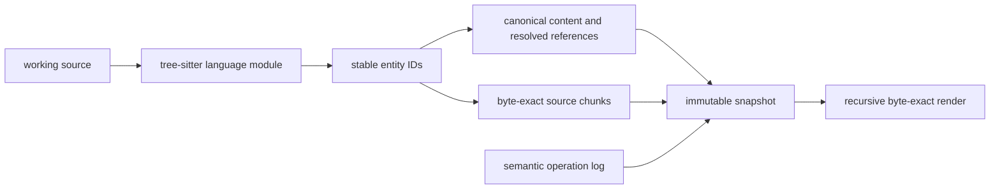

# svc — compiler-grade version control

Agent-generated code is cheap. Understanding it is not.

`svc` is a semantic version-control prototype where definitions have stable identities, operations such as rename are history events, and merges can reject a change that silently redirects a reference. An agent using the included DeepSeek Harness overlay can read the repository normally, but its only write tools are `svc` operations—there is no file editor or shell escape hatch in its tool set.

## The three claims

1. **The store is semantic.** Functions, types, implementations, and their references are stored as identified entities rather than undifferentiated files. Local alpha-renaming and formatting live in the byte representation without changing canonical content.
2. **The operation is the history.** A rename is recorded as a rename, not reconstructed later from a text diff. Agent work is reviewable as a sequence of declared operations and observed semantic classes.
3. **Binding is a merge postcondition.** If a clean text merge changes which local binder an existing reference denotes, `svc` can represent that as a binding conflict instead of shipping compilable but incorrect code.

## Try the working path

Enter the development shell and build:

```sh
nix develop
cargo build --workspace
```

Initialize the Rust demo and inspect its definitions:

```sh
cd demo/config
../../target/debug/svc init
../../target/debug/svc status
../../target/debug/svc list-defs
```

The Git twin reproduces the motivating merge bug independently of `svc`:

```sh
demo/git-twin/build.sh
```

It creates two non-overlapping branches. One shadows `raw` with a normalized value; the other adds `log(&raw)` intending the original binding. Git merges cleanly and the crate compiles, but the log call now resolves to the new shadow.

Run the executable acceptance demo (lines 1–12: rename/merge/binding-conflict
core 1–7, the JavaScript twin on line 8, the agent changeset on line 9,
evolog/undo on 10–11, the in-TUI agent replay on 12) with:

```sh
demo/run.sh target/debug/svc
```

(`demo/run.sh` passes an absolute binary path into `demo/demo-lines.sh`, which `cd`s away.)
`demo/recordings/js-agent.jsonl` records the JavaScript agent run.

The dogfooding line runs `svc` against this repo's own `crates/**` tree —
init, render, `cargo build`, a real `svc rename`, rebuild, undo, rebuild —
so a wrong render byte fails loudly:

```sh
cargo build -p svc && demo/self-host.sh
```

(`demo/self-host.sh` takes an optional svc binary path, default
`target/debug/svc`; it runs all nine checks and exits nonzero if any fail.)

The live A/B (stock dsh vs overlay, two processes, reset from `demo/pristine/`) is `demo/ab.sh`. Without a model credential it asserts identical starting trees and exits 0 with SKIP. `demo/recordings/line9.jsonl` records a completed live overlay run; `demo/recordings/line9.ops.jsonl` drives the deterministic in-TUI replay. Plume fields: `PLUME.md`.

Open the terminal review UI from an initialized repository with `svc tui`.
It shows the entity tree, semantic event stream, and review queue; `q` exits.

## Agent harness

Build `svc`, provide an absolute binary path and a supported model credential, then launch dsh:

```sh
SVC_BIN="$PWD/target/debug/svc" \
OPENROUTER_API_KEY="…" \
npx -y @deepseek-ai/dsh@0.1.5-rc.2 \
  --profile acp --patch harness/overlay.yml
```

The overlay keeps read, glob, and grep; removes direct `edit` and `write`; disables shell, web, and subagent tools; and exposes semantic operations such as `rename`, `add_def`, and `edit_def`. `edit_def` requires a complete item and triggers an ACP permission request. `list_tools` reports the agent's own live schema set. DeepSeek session-log upload is disabled.

## Representation



Canonical content replaces local names with slots and cross-definition names with stable entity IDs. A separate chunked byte representation preserves spelling, trivia, nesting, and declaration-name holes, allowing unchanged source to round-trip exactly.

## Scope and limitations

This is a hackathon prototype, not a replacement for Git today.

- Rust and JavaScript are both verified by round-trip, alpha-renaming,
  extraction-kind, rename-propagation, and CLI acceptance tests.
- Lexical binding is tracked. Type-relative resolution—methods, fields, associated items, and trait dispatch—is deliberately outside the current model.
- `macro_rules!` bodies and several dynamic-language constructs are treated conservatively or as opaque text.
- The store versions language definitions, not build files such as `Cargo.toml` or prose such as this README.
- The classifier checks surviving-reference capture, not behavioral equivalence or task completion.
- Cross-file JavaScript import/export resolution is not modeled in v1; keep
  semantic rename demonstrations within one module.
- A live `svc agent` run requires a supported model credential. The ACP
  transport, permission flow, failure handling, and event stream are covered
  by a scripted fake-agent suite when no credential is available.

## Built with and dependencies

Built at HackMIT 2026 with Codex, Claude Code, Muse, and DeepSeek Harness. Major dependencies are Rust, tree-sitter, tree-sitter-rust, tree-sitter-javascript, redb, postcard, BLAKE3, UUID, similar, clap, serde, ratatui, crossterm, tui-input, agent-client-protocol, Node.js 24, and `@deepseek-ai/dsh@0.1.5-rc.2`.

## Prior art

`svc` builds on ideas from refactoring-aware version control, structure-aware merge, and modern agent editing tools. MolhadoRef recorded refactorings; Mergiraf performs syntax-aware merge; jj provides stable change identities; Serena, semedit, CODESTRUCT, and IDE refactoring tools expose semantic edits to agents. The experiment here is their intersection: a zero-Git semantic store where the checked operation is the history, agents are composed without a text-write tool, and lexical binding is checked after merge.

Licensed under the GNU Affero General Public License v3.0 or later (see `LICENSE`).
