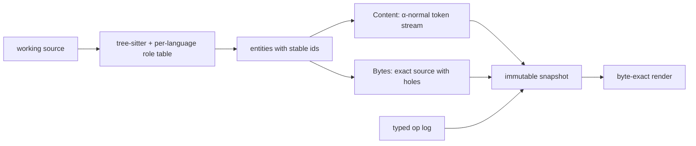

# svc — compiler-grade version control

Agent-generated code is cheap. Understanding it is not.

`svc` is a semantic version-control prototype where definitions have stable identities, operations such as rename are history events, and merges can reject a change that silently redirects a reference. An agent using the included DeepSeek Harness overlay can read the repository normally, but its only write tools are `svc` operations—there is no file editor or shell escape hatch in its tool set.

## The three claims

1. **The store is semantic.** Functions, types, implementations, and their references are stored as identified entities rather than undifferentiated files. Local alpha-renaming and formatting live in the byte representation without changing canonical content.
2. **The operation is the history.** A rename is recorded as a rename, not reconstructed later from a text diff. Agent work is reviewable as a sequence of declared operations and observed semantic classes.
3. **Binding is a merge postcondition.** If a clean text merge changes which local binder an existing reference denotes, `svc` can represent that as a binding conflict instead of shipping compilable but incorrect code.

## How the core works

Everything below is `crates/svc-core` (under 5k lines; its only I/O is a
`Store` trait). The CLI, the redb store, the TUI, the agent host and the
forge are layers over it.



### The unit of storage is a definition, not a file

A source file is parsed with tree-sitter and split into **entities**: top-level
and nested items (`fn`, `struct`, `enum`, `trait`, `impl`, `const`, `mod`, JS
functions/classes/methods/accessors, …) selected by a per-language table
(`lang_rust.rs`, `lang_js.rs`). Each entity gets a `EntityId` — a UUIDv7 minted
once and kept for the entity's whole life — and a record:

```rust
struct EntityRecord {
    name: String,               // the only place the declared name is stored
    kind: Kind,                 // Fn | Struct | Impl | JsMethod | …
    parent: Option<EntityId>,   // impl/class/mod nesting
    file: RelPath, ordinal: u32,
    content: ContentId,         // hash of the canonical token stream
    bytes: BytesId,             // hash of the byte-exact chunk list
}
```

A **snapshot** is `BTreeMap<EntityId, EntityRecord>` plus, per file, only the
bytes after the last item. There are no file blobs. A file is *derived*: sort
the file's root entities by ordinal, expand each, append the trailing bytes.

### Two representations per entity, one hash each

Every entity is stored twice, and the two hashes answer different questions.

**`Content`** (`content.rs`, built in `engine/canon.rs`) is the entity in
α-normal form: a token stream where

- every local binder becomes `Binder(Slot(n), Namespace)` and every use of it
  `Ident(Local(Slot(n), ns))` — slots are numbered by order of binding within
  the item, per namespace (value / type / lifetime / label / macro), so the
  spelling of a parameter or `let` is gone;
- every reference to another entity in the snapshot becomes
  `Ident(Entity(id))` — the callee's *name* is gone too, only its identity
  remains;
- the entity's own declaration name is `Ident(Entity(SELF))`;
- nested entities collapse to a single `Child(id)` token;
- anything unresolved stays `Free(name)`, and comments/whitespace are dropped.

`ContentId = blake3(postcard(Content))`. Two definitions that differ only in
local names, callee names, formatting or comments have the same `ContentId`.
That single property is what lets `rename` be an operation rather than a
diff: renaming `parse` to `parse_config` changes **one `String`** in one
record. No blob is rewritten, no other entity's hash moves (oracle O3), and
the 30 call sites in 26 files that mention it (`tokio::asyncify`, below) are
not edits at all — they are holes that fill in at render time.

**`Bytes`** (`content.rs`, built in `engine/bytes.rs`) is the byte-exact
source of the item with holes punched out:

```rust
enum Chunk { Literal(ByteRange), Child(EntityId), Name(EntityId) }
```

`Literal` ranges index a private copy of the original bytes (spelling,
trivia, layout preserved); `Child` splices a nested entity; `Name(id)` is a
hole that renders as *whatever `id` is currently called* in the snapshot the
render is running against. Alongside, `local_ranges: [(ByteRange, IdentRef)]`
records where every local binder and reference sits in those bytes, so a
rendered file can be annotated back to slots without re-parsing.
`BytesId = blake3(Bytes)`; it changes when you reformat, add a comment or
rename a local, and `ContentId` does not.

Render (`engine/render_impl.rs`) is a recursive expansion of chunks; O1 checks
that `render(ingest(src)) == src` byte-for-byte on `svc-core`'s own source, O6
that `ingest(render(s))` is a fixpoint that mints no new ids.

### Identity across re-parses

When the working copy is re-ingested (`svc status`/`absorb`), parsed items are
matched to the previous snapshot by `(parent, kind, name)` (`assign_ids` in
`engine/mod.rs`); anything else is `Added`/`Removed`. A rename done *as text*
is therefore a delete plus an add with a fresh id — the store cannot tell it
from one — while `svc rename` keeps the id and needs no matching at all. That
asymmetry is the argument for making rename an operation. (A `ContentId`
fallback matcher exists in `engine/diff_impl.rs` but is not on the ingest
path.) O10 pins the
parent/child invariant: every `parent = Some(p)` has exactly one `Child(e)` in
`p`'s chunk list and token stream, and vice versa.

### Local binding is resolved once, by table

`engine/canon.rs::resolve_locals` is a small scoped resolver driven by
per-language `Role` tables rather than by hard-coded grammar knowledge. A
node can be a `Binder { namespace, visibility, locator }` (parameter, `let`
pattern, closure param, generic, label, JS `let`/`const`/class field, …), a
`Reference { namespace }`, or a `Scope { opens, barriers }`. `Visibility`
distinguishes `let` (visible *after* the statement — so `let x = x + 1` reads
the outer `x`), parameters visible only in the body, block-scoped JS
`let`/`const` and hoisted `var`/function declarations. A reference resolves
to the innermost visible binder
with the same name and namespace, or stays `Free`. Rust paths
(`a::b`), pattern constructors (`Some(x)` binds `x`, not `Some`), wildcards
and `..` are handled; type-relative resolution (methods, fields, associated
items) is out of scope for the hackathon build. Nothing in the store depends
on that choice — see below.

The compiler is used as the oracle for this table (O9): every value-namespace
local in every entity of `svc-core` is α-renamed to a fresh name, rendered,
and `cargo check`ed. A binder the table misses, a reference it mistakes for a
binder, or two bindings collapsed to one name breaks the build.

### Classifying an edit

`edit_def` replaces one entity's body and records an **observed class**
(`engine/classify.rs`) next to the agent's **declared intent**:

| observed | meaning |
|---|---|
| `Alpha` | same `Content`, bytes differ only at local-binder spellings |
| `DocsOnly` | same `Content`, other byte changes (comments, layout) |
| `BindingPreserving` | body changed, but every reference that survives the edit still denotes the same target |
| `BindingChanging` | some surviving reference now denotes a different binder or entity |

The surviving-reference check lines up old and new renders with a line diff,
builds a slot bijection from binder sites on unchanged lines, and asks
whether each unchanged reference maps through it. `refactor` declared with
`BindingChanging` observed is flagged in the review queue; so is `docs` that
changed anything semantic, or `fix` that changed nothing.

### Merge, and the binding post-condition

`engine/merge.rs::merge(base, a, b)` is a three-way merge **per entity**, not
per file. Attributes (`name`, `parent`, `file`, `ordinal`) merge
independently — rename on one side and body edit on the other commute for
free. Bodies that both sides touched are split into **statement atoms**
(signature-plus-brace, then one atom per body statement), each atom is
hashed, and the atom-hash sequences are merged as lines; a real overlap is a
`Content` conflict with hunks expressed as atom ranges. Add/add with the same
`(parent, kind, name)` is unified to one id; delete/edit keeps the edited
record and reports it.

Then the step git does not have: the merged snapshot is **rendered and
re-resolved**, and for every entity, every reference that existed on some
input side is compared with what it denotes now. One side adds
`log(&raw)` after `let raw = read(path)`; the other inserts
`let raw = normalize(&raw)` between them. Neither hunk overlaps, the merge
succeeds textually and compiles — but `raw` in `log(&raw)` now resolves to a
different slot than it did on the side that wrote it, and `svc` records

```text
binding conflict in load: `raw` at src/main.rs:73 meant the `let raw` at :67,
now means the `let raw` at :68 (shadowed)
```

as a `Conflict::Binding` on the snapshot (demo line 6; `demo/git-twin` shows
git merging the same two branches clean). Slots are matched across sides by
the same line-diff bijection the classifier uses, so an unrelated statement
inserted above does not renumber a reference into a false conflict.

### History is a log of typed operations

`Op` is a closed enum — `Rename`, `Move`, `Relocate`, `AddDef`, `EditDef`,
`Delete`, `Merge`, `Undo`, `New`, `Branch`, `Describe`, `Absorb` — and every
CLI verb appends one `OpLogEntry { op, observed, before: View, after: View }`
where a `View` is `(root snapshot, all change heads)`. Snapshots are
content-addressed and immutable (`parents` for merge ancestry,
`predecessors` for amend history, like jj's evolution log). `undo` is
"restore `before`" and O4 checks it returns the exact snapshot hash; O5
replays the op log from an empty store and requires the same head. Because
`Absorb` (reconciling hand edits) is itself an op that records the resulting
snapshot, a repository is fully determined by its op log.

### What it is not (yet), and why that is a scope choice

The resolver is lexical only: no types, so `x.parse()` on an unknown
receiver is a `Free` mention, and `svc rename` reports how many of those it
left alone instead of guessing. `macro_rules!` bodies and `use` lines are
opaque entities. Cross-file JS import/export is not modelled. The resolver
tables are the trust boundary, which is why O9 runs them through the
compiler.

None of this is baked into the format. The store never sees syntax: an
entity is a record keyed by `EntityId`, a `Content` stream whose references
are already `Local(slot)` / `Entity(id)` / `Free(name)`, and a `Bytes` blob
whose holes are `Name(id)`. The only component that decides *which* of those an
identifier becomes is `resolve` in `engine/mod.rs`, and it is a pure function
from (item, source, `Env`) to a `Resolution`. Swapping the name-lookup `Env`
for a type-aware backend — rust-analyzer's HIR, `tsc`'s checker, or a
per-language `Lang` that answers "what does this method call denote?" —
turns the `Free("parse")` in `x.parse()` into an `Entity(id)`, at which point method
renames, field renames and trait-item renames become the same one-field
write, the binding post-condition covers receiver-relative rebinding, and
the classifier sees through `impl` dispatch. Renders, hashes, the op log,
merge and undo do not change. What exists today is the lexical instance of
that design plus the oracles O1–O10 that check it. Caveat on the swap: `Env`
is currently a concrete `HashMap<(name, Namespace), EntityId>`, so a
type-aware backend means making it a trait, not just a different map.

## Try the working path

Enter the development shell and build:

```sh
nix develop
cargo build --workspace
```

Initialize the Rust demo and inspect its definitions:

```sh
cd demo/config
../../target/debug/svc init
../../target/debug/svc status
../../target/debug/svc list-defs
```

The Git twin reproduces the motivating merge bug independently of `svc`:

```sh
demo/git-twin/build.sh
```

It creates two non-overlapping branches. One shadows `raw` with a normalized value; the other adds `log(&raw)` intending the original binding. Git merges cleanly and the crate compiles, but the log call now resolves to the new shadow.

Run the executable acceptance demo (lines 1–12: rename/merge/binding-conflict
core 1–7, the JavaScript twin on line 8, the agent changeset on line 9,
evolog/undo on 10–11, the in-TUI agent replay on 12) with:

```sh
demo/run.sh target/debug/svc
```

(`demo/run.sh` is the whole gate: `demo/demo-lines.sh` — lines 1–12, the forge, and line 14, the self-hosting run — then `demo/store-stress.sh`: six named checkouts on one store, each renaming its own entity five times at once — every op lands, the op log stays contiguous, each checkout shows only its own rename and none is stale, and with a 1 ms lock wait the only failure mode is `store busy`. It exits with the total failure count; `SVC_SKIP_SELF_HOST=1` skips line 14.)
`demo/recordings/js-agent.jsonl` records the JavaScript agent run.

The dogfooding line runs `svc` against this repo's own `crates/**` tree —
init, render, `cargo build`, a real `svc rename`, rebuild, undo, rebuild —
so a wrong render byte fails loudly:

```sh
cargo build -p svc && demo/self-host.sh
```

(`demo/self-host.sh` takes an optional svc binary path, default
`target/debug/svc`; it runs all nine checks and exits nonzero if any fail.)

The live A/B (stock dsh vs overlay, two processes, reset from `demo/pristine/`) is `demo/ab.sh`. Without a model credential it asserts identical starting trees and exits 0 with SKIP. `demo/recordings/line9.jsonl` records a completed live overlay run; `demo/recordings/line9.ops.jsonl` drives the deterministic in-TUI replay. Plume fields: `PLUME.md`.

Every verb prints a sentence by default and the machine form with `--json`.
`svc rename` also says how many mentions it could not track:

```text
$ svc rename --entity parse --new-name parse_config
renamed parse → parse_config
1 method call `.parse(…)` left unchanged: receiver types are not resolved
$ svc merge a6
merged into change 8230 (snapshot 58f0): 1 conflict(s)
    [0] binding conflict in load: `raw` at src/main.rs:73 meant the `let raw` at src/main.rs:67, now means the `let raw` at src/main.rs:68 (shadowed)
```

### The review TUI, with the agent inside it

`svc tui` from an initialized repository shows the entity tree (left), the
selected entity's source, canonical stream and history (right), and the review
queue (bottom): every `edit_def`, green when declared and observed intent
agree, red when they don't, plus every binding conflict. Keys: `j/k`, `tab`,
`enter`, `a`/`r` allow or reject the pending ask, `p` asks an agent that ended
its turn early to continue, `u` undo, `c` cancel, `q` quit.

`svc tui --agent "<task>"` runs the task under dsh **inside** the TUI: the ops
stream into the panes as they land, the `edit_def` permission request lands in
the queue and is answered from there, and the whole run is one changeset that
`svc undo` reverts in one step (demo line 12). Without a model credential,
`SVC_AGENT_COMMAND="node demo/replay-agent.mjs demo/recordings/line9.ops.jsonl"`
hosts a scripted ACP agent that replays the three recorded ops through the real
binary; that is what the acceptance script's line 12 gates. Any ACP-on-stdio
agent works the same way; one that advertises an auth method (Devin's
`devin acp`) is authenticated with `SVC_AGENT_API_KEY`.

For a hands-on tour, `demo/play.sh` drops you in a scratch copy of the demo
crate with `svc` on `PATH` and a cheat-sheet (`--tui`, `--agent`).

### The forge

`crates/svc-forge` is a read-only localhost browser for a semantic repository:
snapshots, typed entities, typed operations, conflicts and the review queue.
`svc forge export` writes its catalog from the store into `.svc/forge.json`
(atomically, so it never contends with a writer), and the forge serves it:

```sh
svc forge export
cargo run -p svc-forge -- --catalog .svc/forge.json   # http://127.0.0.1:7742
```

The acceptance script's F1–F5 export the demo repository, start the forge on an
ephemeral port and check that `/operations` and `/reviews` match the store.

### Real crates

`svc init` on `syn` (97 files) ingests 7,365 entities in 14 s; on `tokio`
(555 files) 11,786 entities in 19 s; `svc status` on either takes 0.06–0.15 s.
Renaming `tokio`'s `asyncify` (30 call sites across 26 files) is one `svc log`
line, 0.26 s, and the crate still passes `cargo check --features full`; git shows
the same change as 26 files, 55 insertions, 55 deletions. Method calls on typed
receivers are not resolved (no types), and `svc rename` says so rather than
silently leaving 62 `.push_value(…)` calls behind.

## Agent harness

Build `svc`, provide an absolute binary path and a supported model credential, then launch dsh:

```sh
SVC_BIN="$PWD/target/debug/svc" \
OPENROUTER_API_KEY="…" \
npx -y @deepseek-ai/dsh@0.1.5-rc.2 \
  --profile acp --patch harness/overlay.yml
```

The overlay keeps read, glob, and grep; removes direct `edit` and `write`; disables shell, web, and subagent tools; and exposes semantic operations such as `rename`, `add_def`, and `edit_def`. `edit_def` requires a complete item and triggers an ACP permission request. `list_tools` reports the agent's own live schema set. DeepSeek session-log upload is disabled.

## Scope and limitations

This is a hackathon prototype, not a replacement for Git today.

- Rust and JavaScript are both verified by round-trip, alpha-renaming,
  extraction-kind, rename-propagation, and CLI acceptance tests.
- Lexical binding is tracked. Type-relative resolution—methods, fields, associated items, and trait dispatch—is deliberately outside the current model.
- `macro_rules!` bodies and several dynamic-language constructs are treated conservatively or as opaque text.
- The store versions language definitions, not build files such as `Cargo.toml` or prose such as this README.
- The classifier checks surviving-reference capture, not behavioral equivalence or task completion.
- Cross-file JavaScript import/export resolution is not modeled in v1; keep
  semantic rename demonstrations within one module.
- A live `svc agent` run requires a supported model credential. The ACP
  transport, permission flow, failure handling, and event stream are covered
  by a scripted fake-agent suite when no credential is available.
- With `deepseek-chat`, one live run in three ends its turn after the first
  op or narrates the tool calls instead of making them; the TUI's `p` key
  re-prompts the same session. Ops are correct by construction either way.
- `svc undo` restores `root` and the heads the op recorded but cannot remove a
  head (the frozen `Store` API has no delete); repeated `undo` walks back
  through a checkout's own ops, `svc op restore <n>` is the redo.
- Named checkouts share one store and one op log; each checkout undoes its own
  ops and refuses to mutate while behind its change's head. Concurrent writers
  are serialised by one exclusive store session with a bounded wait
  (`SVC_LOCK_TIMEOUT_MS`), not merged.

## Built with and dependencies

Built at HackMIT 2026 with Codex, Claude Code, Muse, and DeepSeek Harness. Major dependencies are Rust, tree-sitter, tree-sitter-rust, tree-sitter-javascript, redb, postcard, BLAKE3, UUID, similar, clap, serde, ratatui, crossterm, tui-input, agent-client-protocol, axum, Node.js 24, and `@deepseek-ai/dsh@0.1.5-rc.2`.

## Prior art

`svc` builds on ideas from refactoring-aware version control, structure-aware merge, and modern agent editing tools. MolhadoRef recorded refactorings; Mergiraf performs syntax-aware merge; jj provides stable change identities; Serena, semedit, CODESTRUCT, and IDE refactoring tools expose semantic edits to agents. The experiment here is their intersection: a zero-Git semantic store where the checked operation is the history, agents are composed without a text-write tool, and lexical binding is checked after merge.

Licensed under the GNU Affero General Public License v3.0 or later (see `LICENSE`).
